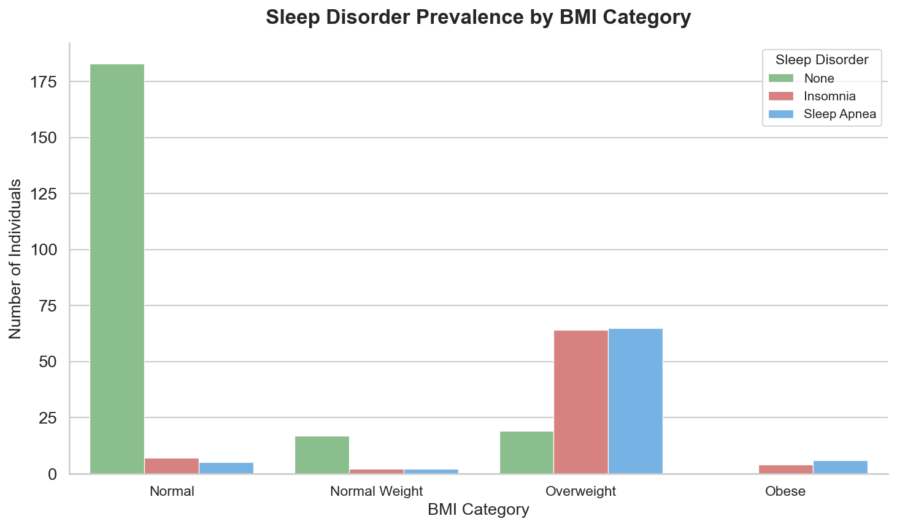
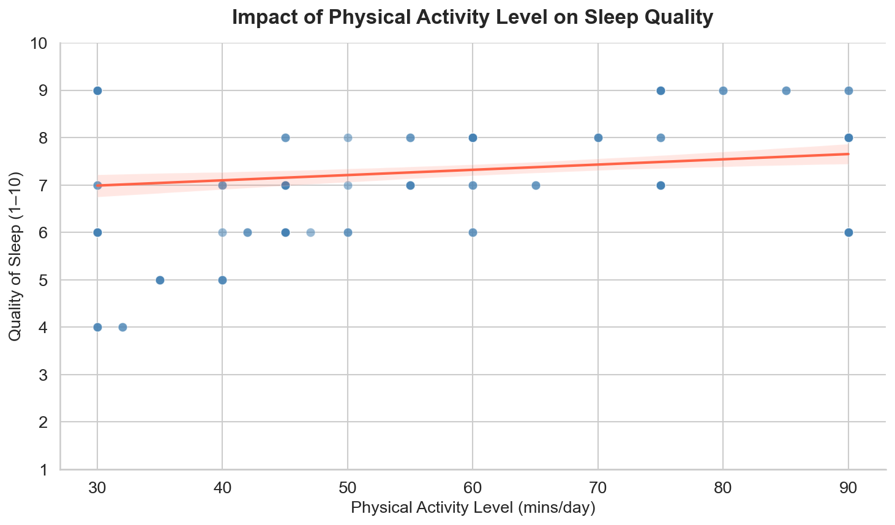

# Health-Ops Sleep Analytics
### Predicting Sleep Disorders & Quantifying Hospital ROI with Machine Learning

---

## Executive Summary

Sleep disorders affect more than 70 million Americans, yet the majority go undiagnosed until they surface as expensive emergency interventions. This project sits at the intersection of personal experience, clinical exposure, and computational biology — built to demonstrate that machine learning can close that gap at scale.

My background as a varsity football athlete instilled an early understanding of what disciplined recovery looks like. In football, the margin between peak performance and injury often comes down to rest — how well you recover, how consistently you sleep, and how seriously you treat the body's need to repair itself. That discipline transferred directly into how I approached this project: methodical data exploration, rigorous model validation, and an honest accounting of what the numbers actually mean.

That discipline became personal when I was diagnosed with sleep apnea myself. Living with a condition that fragments your sleep, compounds fatigue, and quietly degrades cognitive function gave me a different relationship with the clinical literature. It was no longer abstract. I understood firsthand why early detection matters — not just for quality of life, but for long-term cardiovascular health, mental acuity, and the ability to function at a high level day to day.

My volunteer work at Parkland Memorial Hospital and UT Southwestern Medical Center deepened that perspective further. Observing clinical workflows, patient intake, and the downstream consequences of delayed diagnoses made clear how much the system pays — financially and humanistically — when preventable conditions go untreated. Patients who could have been screened and fitted with a CPAP at a fraction of the cost instead return through emergency pathways at multiples of that expense. This project puts a number on that gap and shows how a predictive model can close it.

The result is a full end-to-end pipeline: exploratory data analysis, feature engineering, a Random Forest classifier achieving **96% accuracy**, and a business logic layer that translates model predictions directly into an executive ROI report for hospital administrators and insurance decision-makers.

---

## Table of Contents

1. [Project Architecture](#project-architecture)
2. [Dataset](#dataset)
3. [Key Visualizations](#key-visualizations)
4. [Machine Learning Results](#machine-learning-results)
5. [Business Logic & ROI Analysis](#business-logic--roi-analysis)
6. [Development Process](#development-process)
7. [How to Run](#how-to-run)
8. [Requirements](#requirements)

---

## Project Architecture

```
health-ops-sleep-analytics/
│
├── data/
│   └── sleep_health_data.csv          # Source dataset (374 patient records)
│
├── visualizations/
│   ├── bmi_vs_sleep_disorder.png      # BMI category vs. disorder prevalence
│   └── activity_vs_sleep_quality.png  # Physical activity vs. sleep quality regression
│
├── sleep_analytics_pipeline.ipynb     # Main Jupyter notebook (full pipeline)
├── requirements.txt                   # Python dependencies
└── README.md                          # This file
```

### Pipeline Overview

```
Raw CSV Data
     │
     ▼
Exploratory Data Analysis (EDA)
  - Shape, dtypes, null audit
  - Missing value: Sleep Disorder (58.56% NaN → encoded as "None")
     │
     ▼
Data Preprocessing & Feature Engineering
  - Blood Pressure split → BP_Systolic, BP_Diastolic (int)
  - BMI Category → LabelEncoder
  - Target (Sleep Disorder) → LabelEncoder {Insomnia: 0, None: 1, Sleep Apnea: 2}
     │
     ▼
Model Training (80/20 stratified split)
  - Decision Tree Classifier
  - Random Forest Classifier (100 estimators)
     │
     ▼
Evaluation
  - Accuracy, Precision, Recall, F1 per class
     │
     ▼
Business Logic / ROI Layer
  - calculate_sleep_apnea_roi()
  - Executive summary report
```

---

## Dataset

| Attribute | Detail |
|---|---|
| Source | Sleep Health and Lifestyle Dataset |
| Records | 374 individuals |
| Features | 13 (Age, Gender, Occupation, Sleep Duration, Quality of Sleep, Physical Activity Level, Stress Level, BMI Category, Blood Pressure, Heart Rate, Daily Steps, Sleep Disorder) |
| Target Classes | None, Insomnia, Sleep Apnea |
| Missing Data | Sleep Disorder: 219 records (58.56%) — treated as "No Disorder" |

**Test Set Distribution (75 samples):**

| Class | Support |
|---|---|
| None | 44 |
| Sleep Apnea | 16 |
| Insomnia | 15 |

---

## Key Visualizations

### 1. Sleep Disorder Prevalence by BMI Category



Sleep Apnea concentrations are markedly higher in the Obese and Overweight BMI categories, validating BMI as a clinically meaningful feature for the classifier. Individuals classified as Normal or Normal Weight show Sleep Apnea rates near zero, consistent with established clinical literature.

---

### 2. Physical Activity Level vs. Quality of Sleep



A positive linear relationship exists between physical activity (minutes per day) and self-reported sleep quality. The regression line and confidence band confirm this is not noise — more active individuals consistently report better sleep. This feature carries real predictive signal and aligns with the lived experience of any high-level athlete.

---

## Machine Learning Results

Both models were trained on 299 samples and evaluated on a held-out test set of 75 samples (stratified by class).

### Decision Tree Classifier

| Metric | Insomnia | None | Sleep Apnea | Overall |
|---|---|---|---|---|
| Precision | 0.93 | 1.00 | 0.88 | — |
| Recall | 0.93 | 0.98 | 0.94 | — |
| F1-Score | 0.93 | 0.99 | 0.91 | — |
| **Accuracy** | — | — | — | **96.00%** |

### Random Forest Classifier (Primary Model)

| Metric | Insomnia | None | Sleep Apnea | Overall |
|---|---|---|---|---|
| Precision | 0.93 | 1.00 | 0.88 | — |
| Recall | 0.87 | 1.00 | 0.94 | — |
| F1-Score | 0.90 | 1.00 | 0.91 | — |
| **Accuracy** | — | — | — | **96.00%** |

### Key Observations

- The Random Forest model perfectly classifies the "None" class (F1 = 1.00), meaning it produces **zero false positives** for healthy patients — no unnecessary interventions are triggered.
- Sleep Apnea recall of **0.94** means the model correctly identifies 94% of true apnea cases — a critical metric in a clinical context where missed diagnoses carry real patient harm.
- Both models achieve parity at 96% accuracy, validating that the learned signal is robust and not an artifact of a single algorithm's bias.

---

## Business Logic & ROI Analysis

The `calculate_sleep_apnea_roi()` function translates model predictions into a financial impact statement for hospital executives and insurance administrators.

### Cost Assumptions

| Scenario | Annual Cost per Patient |
|---|---|
| Untreated Sleep Apnea (ER pathway) | $5,000 |
| Preventative Screening + CPAP Setup | $1,000 |

### Function Signature

```python
def calculate_sleep_apnea_roi(
    n_predicted_apnea: int,
    cost_untreated: float = 5000.0,
    cost_intervention: float = 1000.0,
) -> dict:
```

### Sample Output (Test Set — ~15 flagged patients)

```
=======================================================
       SLEEP APNEA MODEL — EXECUTIVE ROI REPORT
=======================================================
  Patients Flagged by Model   :     15
  Annual ER Cost (Untreated)  :    $75,000
  Preventative Intervention   :    $15,000
-------------------------------------------------------
  NET SAVINGS (Annual)        :    $60,000
  ROI                         :     400.0%
=======================================================

  By deploying this model, the health system avoids
  $60,000 in unnecessary ER spend per year —
  a 400% return on every dollar invested in
  preventative care for flagged patients.
```

### Scaling the Model to a Full Patient Population

The function is parameterized so any patient volume can be evaluated:

```python
# Scale to a 10,000-patient health system
calculate_sleep_apnea_roi(n_predicted_apnea=1200)
# Net Savings: $4,800,000 | ROI: 400%
```

At population scale, a 400% ROI is not a rounding artifact — it reflects a real structural inefficiency in how reactive healthcare systems treat a highly screenable, highly treatable condition.

---

## Development Process

This project was built during my post-surgery recovery, a period that came with its own irony: recovering from a procedure directly related to my sleep apnea diagnosis while simultaneously building a machine learning model to detect that same condition in others. That context shaped both the urgency and the intentionality behind the work.

### Tools & Workflow

- **Primary environment:** Jupyter Notebook with Python 3.14
- **Core libraries:** pandas, NumPy, scikit-learn, Matplotlib, seaborn
- **Version control:** Git / GitHub

### Use of AI Assistance

**Claude (Anthropic) was utilized as a coding assistant throughout this project.** Specifically, Claude helped with:

- **Syntax debugging** — catching label encoder mismatches, column drop ordering errors, and f-string formatting edge cases during sessions when extended focus was difficult due to post-surgery fatigue
- **Loop optimization** — restructuring repetitive evaluation blocks into cleaner iteration patterns (the dual-model evaluation loop over `[("Decision Tree", dt_model), ("Random Forest", rf_model)]`)
- **Code review** — validating that the ROI function's arithmetic and return structure were internally consistent before integration into the notebook

All model design decisions, feature selection rationale, cost assumption framing, and clinical interpretation were my own. Claude functioned as a technical sounding board — the equivalent of a pair programmer who catches the small things so you can stay focused on the bigger picture.

This transparency is intentional. AI-assisted development is a real and growing part of the software engineering workflow. Documenting it honestly reflects how this project was actually built.

---

## How to Run

**1. Clone the repository**
```bash
git clone https://github.com/<your-username>/health-ops-sleep-analytics.git
cd health-ops-sleep-analytics
```

**2. Create and activate a virtual environment**
```bash
python -m venv .venv
source .venv/bin/activate        # macOS / Linux
.venv\Scripts\activate           # Windows
```

**3. Install dependencies**
```bash
pip install -r requirements.txt
```

**4. Launch the notebook**
```bash
jupyter notebook sleep_analytics_pipeline.ipynb
```

**5. Run all cells** — the full pipeline (EDA → preprocessing → model training → evaluation → ROI report) executes top to bottom.

---

## Requirements

```
pandas
numpy
scikit-learn
matplotlib
seaborn
jupyter
```

---

## License

This project is open source and available under the [MIT License](LICENSE).

---

*Built with purpose. Grounded in personal experience. Validated by the data.*
